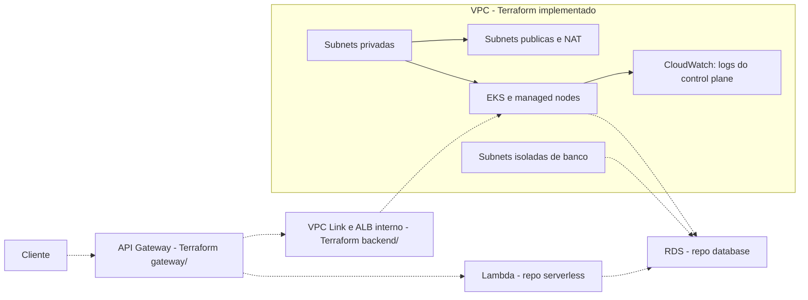

# Oficina Infra Kubernetes

Terraform da plataforma AWS compartilhada do laboratorio: rede privada, EKS e
contratos de integracao com os outros tres repositorios do Tech Challenge.

## Estado desta entrega

Codigo implementado e validado localmente:
- VPC em duas ou tres zonas; subnets publicas, privadas de workloads e isoladas de banco.
- Internet Gateway, NAT configuravel (um no laboratorio ou um por zona), rotas e endpoint S3.
- EKS 1.35, managed node group AL2023 x86_64 com dois nos por padrao, discos criptografados e IMDSv2.
- Acesso Kubernetes privado por padrao e administradores IAM explicitos via EKS Access Entries.
- VPC CNI com IRSA separado, CoreDNS, kube-proxy e metrics-server.
- Logs do control plane no CloudWatch com retencao e suporte a NetworkPolicy no CNI.
- SG de origem das Lambdas por ambiente e outputs para integrar RDS, funcoes e Gateway.
- Backend S3 parcial, lock do provider e testes simulados da plataforma e IAM do controlador.
- Root gateway/ por ambiente: HTTP API HTTPS, integracao Lambda v2, authorizer JWT e rotas de cliente com backend privado opcional.
- Logs, limites de requisicoes e 12 testes simulados do Gateway.

**Nenhum recurso AWS foi provisionado.** Testes simulados nao comprovam permissao,
quota, disponibilidade de instancias/addons, bootstrap dos nos ou conectividade real.

Ainda pendentes: bootstrap do bucket/OIDC de CI, plan autenticado, provisionamento/integracao do Gateway,
instalacao do controlador, namespaces/RBAC/NetworkPolicies, autoscaler
de nos, integracao de observabilidade e CD de staging/producao. Os limites min/max
do node group nao implementam autoscaling por demanda por si so.

## Tecnologias e responsabilidades

Terraform >= 1.10 e < 2.0; CI em 1.15.8; provider AWS 6.x fixado em
`infra/.terraform.lock.hcl`. Amazon VPC, EKS, EC2, IAM e CloudWatch.

As quatro camadas .NET, Dockerfile, Docker Compose e kind continuam na
[Oficina-Mecanica](https://github.com/Venomouus/Oficina-Mecanica).
Dockerfile nao se aplica a este repositorio, que nao produz uma imagem de aplicacao.

## Arquitetura



As linhas tracejadas indicam integracoes ainda pendentes.
[Arquitetura e limites](docs/arquitetura.md),
[contratos entre repositorios](docs/integracoes.md),
[RFC da escolha AWS](docs/rfcs/001-plataforma-aws.md) e
[ADR da plataforma compartilhada](docs/adrs/001-plataforma-compartilhada.md).

## Validar localmente sem AWS

Na raiz do repositorio:

```powershell
terraform -chdir=infra fmt -check -recursive
terraform -chdir=infra init -backend=false -input=false -lockfile=readonly
terraform -chdir=infra validate -no-color
terraform -chdir=infra test -no-color
```

Esses comandos nao precisam de conta/credenciais AWS. O init baixa o provider do
Registry; os testes usam `mock_provider "aws"` em todos os cenarios. Nao substitua
esses testes por um apply real durante o desenvolvimento.

O [arquivo de exemplo](infra/terraform.tfvars.example) usa conta/role ilustrativas.
Nao e necessario copia-lo para executar os testes.
[Configuracao, estado remoto e deploy futuro](infra/README.md).

O root gateway/ possui backend proprio por ambiente. Para valida-lo, repita os
quatro comandos acima com -chdir=gateway. Seus testes tambem usam somente AWS
simulada. [Bootstrap, rotas e contratos do Gateway](gateway/README.md).

## CI e branches

Fluxo: `feature/* -> PR develop -> PR master`.
O workflow `.github/workflows/ci.yml` executa fmt, init sem backend, validate e
test de infra/, gateway/ e backend/ em PRs para develop/master, pushes nessas branches e acionamento manual.
Mantenha **validate-terraform** obrigatorio nas protecoes das duas branches,
PR obrigatorio, sem bypass, force push ou exclusao. Para trabalho individual,
aprovacao por outra pessoa pode permanecer desabilitada.

| Ambiente GitHub | Branch | Namespace a criar |
|---|---|---|
| staging | develop | oficina-staging |
| producao | master | oficina-producao |

**Mantenha DEPLOY_ENABLED=false.** Este workflow ainda e apenas CI, sem jobs apply.
A variavel nao impede um apply manual no terminal.

O root `infra/` administra recursos compartilhados em **um unico estado**.
A proposta de CD reserva a aplicacao desse root para a branch master; staging e
producao usam gateway/ e backend/ com estados proprios por ambiente. Nunca aplicar
essa mesma VPC/EKS em estados diferentes para cada branch. O CD automatico de
ambos os ambientes e um requisito ainda a implementar; veja o ADR.

## Custos e ciclo de vida

O codigo pode ser desenvolvido sem AWS. Provisionar EKS, EC2/EBS, NAT e IPv4
tem cobranca; credito de conta nao significa infraestrutura permanentemente gratis.
Consulte os [precos EKS](https://aws.amazon.com/eks/pricing/) e
[precos VPC/NAT](https://aws.amazon.com/vpc/pricing/) antes de habilitar o deploy.

O padrao single usa um NAT, aceitando dependencia da zona de saida. per_az aumenta
a disponibilidade e a quantidade de NATs. Preparar e testar agora; provisionar
perto da demonstracao, manter pelo periodo de avaliacao e remover apos preservar
os dados/evidencias. O backend e os backups exigem ciclo de vida separado.

## APIs relacionadas

- [Swagger/execucao da API principal](https://github.com/Venomouus/Oficina-Mecanica/blob/master/docs/autenticacao-cliente-jwt.md).
- [Contrato do serverless](https://github.com/Venomouus/Oficina-serverless/blob/master/docs/contratos.md).
- Swagger API local no roteiro integrado: http://127.0.0.1:5080/swagger.
- Swagger serverless local: http://127.0.0.1:5081/swagger.
- API com Docker Compose completo: http://localhost:8080/swagger.
- URLs de deploy AWS: ainda inexistentes.

## Repositorios relacionados

- [Aplicacao](https://github.com/Venomouus/Oficina-Mecanica).
- [Serverless](https://github.com/Venomouus/Oficina-serverless).
- [Banco gerenciado](https://github.com/Venomouus/Oficina-infra-database).

## Backend privado da API

O root [backend/](backend/README.md) implementa VPC Link, ALB interno, target group IP
e SGs por ambiente, com dez testes simulados. O output customer_backend conecta
o Gateway; kubernetes_manifest fornece Service ClusterIP e TargetGroupBinding
para a API em 8080. Repetir os comandos de validacao com -chdir=backend.

O root infra/ tambem prepara IAM/IRSA e values de um unico controlador de targets,
com um teste adicional. [Instalacao futura do controlador](docs/controller.md).
CI valida os tres roots. Nenhum recurso ou workload foi instalado na AWS.
