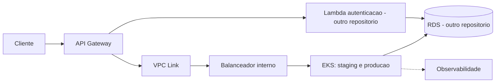

# Oficina Infra Kubernetes

Preparacao da infraestrutura AWS da oficina mecanica: rede, Kubernetes (EKS),
API Gateway e componentes de observabilidade. Este repositorio faz parte da
separacao em quatro repositorios do Tech Challenge.

## Estado deste PR

Implementado:
- Base Terraform com variaveis validadas e planejamento de nomes e CIDRs.
- Configuracao de exemplo com staging/develop e producao/master.
- Pipeline de fmt, init sem backend e validate.
- Documentacao de arquitetura, ownership e proximas etapas.

Ainda pendente:
- Recursos AWS: VPC, EKS, nos, IAM, API Gateway, VPC Link e balanceador.
- Instalacao dos componentes de escalabilidade, seguranca e monitoramento.
- Estado remoto, OIDC, plan autenticado e CD dos dois ambientes.
- Validacao na AWS e URLs de deploy.

A base atual nao possui provider AWS nem recursos provisionaveis. Um CI verde
confirma a validacao local desta estrutura; nao confirma um cluster em funcionamento.

## Tecnologias

Terraform e GitHub Actions na preparacao atual. AWS EKS, API Gateway, VPC e
Kubernetes fazem parte da arquitetura a implementar na fase de nuvem.

## Estrutura

```text
.github/workflows/ci.yml
infra/
  versions.tf
  variables.tf
  main.tf
  outputs.tf
  terraform.tfvars.example
  README.md
docs/
  arquitetura.md
```

## Arquitetura planejada



Os componentes do diagrama ainda nao foram provisionados.
[Detalhes, limites do laboratorio e responsabilidades](docs/arquitetura.md).

## Executar a validacao local

Requer Terraform >= 1.6 e < 2.0. A pipeline usa 1.15.8.

```powershell
terraform -chdir=infra fmt -check -recursive
terraform -chdir=infra init -backend=false -input=false
terraform -chdir=infra validate
```

O arquivo `infra/terraform.tfvars.example` apresenta os dois ambientes logicos.
A proposta economica e usar um cluster compartilhado no laboratorio. Os estados
e o fluxo de alteracao dos recursos compartilhados serao definidos no CD para
evitar duas pipelines gerenciando o mesmo recurso de forma independente.

Nao e necessario configurar credenciais AWS para o CI atual.
Dockerfile nao se aplica: este repositorio contem infraestrutura, sem aplicacao
containerizada. Docker Compose, kind e a imagem da API ficam na aplicacao principal.

## CI e protecao de branches

Fluxo: `develop -> feature/config-ci -> PR para develop -> PR para master`.

A pipeline executa em:
- PRs destinados a develop e master.
- Pushes para develop e master.
- Acionamento manual.

Um push em feature so inicia esse CI automaticamente quando ha PR aberto.
O unico check deste repositorio e **validate-terraform**.

Depois da primeira execucao bem-sucedida, configure as regras de develop e master:
1. Exigir Pull Request.
2. Exigir validate-terraform aprovado.
3. Exigir resolucao de conversas e impedir bypass.
4. Bloquear force push e exclusao.
5. Para trabalho individual, deixar Require approvals desmarcado.

Nao adicione os checks build-test, docker ou deploy-kind da API aqui.

## Deploy

| Ambiente GitHub | Branch autorizada | Namespace planejado |
|---|---|---|
| staging | develop | oficina-staging |
| producao | master | oficina-producao |

Mantenha a variavel de repositorio `DEPLOY_ENABLED=false`.

Este PR contem apenas CI. Ainda nao existe job de deploy que consuma essa variavel;
muda-la para true agora nao provisiona a AWS. Ao implementar o CD, seus jobs
deverao exigir o valor true e referenciar os ambientes corretos.

Antes de habilitar deploy sera necessario:
- Confirmar acesso aos servicos, creditos e estimativa de custos.
- Implementar recursos, estado remoto com locking e identidade OIDC.
- Definir a promocao dos recursos compartilhados e isolar os estados especificos
  dos ambientes.
- Executar plan e validar permissoes, rede e dependencias.
- Integrar Gateway, API e funcoes, com testes apos o deploy.
- Documentar URLs reais, rollback e remocao dos recursos apos a avaliacao.

[Detalhes Terraform e ordem de implementacao](infra/README.md).

## APIs relacionadas

Este repositorio nao expoe uma API de negocio.

- [Swagger e instrucoes da API principal](https://github.com/Venomouus/Oficina-Mecanica#collection--swagger).
- [Contratos planejados da autenticacao e notificacao](https://github.com/Venomouus/Oficina-serverless/blob/master/docs/contratos.md).
- Swagger local da API: http://localhost:8080/swagger, apos iniciar o Docker Compose
  no repositorio da aplicacao.
- URLs AWS: pendentes da implementacao e do deploy.

## Repositorios

- [Aplicacao](https://github.com/Venomouus/Oficina-Mecanica)
- [Serverless](https://github.com/Venomouus/Oficina-serverless)
- [Banco gerenciado](https://github.com/Venomouus/Oficina-infra-database)
