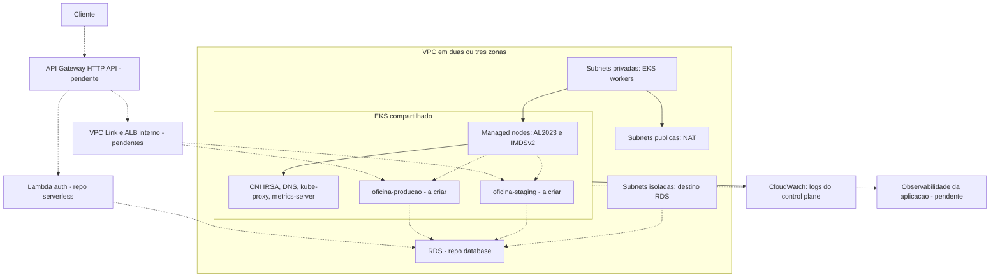

# Arquitetura AWS do laboratorio

O Terraform implementa a fundacao de rede e Kubernetes. Os recursos ainda nao
foram provisionados. Componentes e integracoes seguintes estao marcados no diagrama.

## Rede e disponibilidade

Subnets publicas usam os primeiros blocos do CIDR; isoladas de banco usam offset 4
e privadas de workloads offset 8. Cada sub-rede recebe quatro bits adicionais de
prefixo; os blocos nao se sobrepoem, inclusive com tres zonas. Nenhuma subnet
atribui IPv4 publico automaticamente. EKS nodes usam apenas subnets privadas.

Apenas as publicas apontam ao Internet Gateway. As privadas saem por NAT, para
imagens e APIs externas; as de banco so possuem a rota local da VPC. O endpoint S3
e associado as tabelas privadas. O SG default da VPC nao tem regras de acesso.

O modo single usa um NAT na primeira zona e e uma concessao de custo do laboratorio.
Uma falha nessa zona pode interromper a saida de ambas as zonas, mesmo que outros
nos estejam saudaveis. per_az cria NAT e rota de saida em cada zona.

O control plane EKS e gerenciado. Dois workers reduzem dependencia de um unico no,
mas nao comprovam disponibilidade da aplicacao. Distribuicao dos pods, probes,
requests/limits, PDB, HPA e teste de falha ainda devem ser aplicados e demonstrados.

## Identidade e isolamento

Acesso Kubernetes usa IAM Access Entries explicitas. O endpoint e privado por
padrao; acesso publico opcional recebe apenas CIDRs administrativos restritos.
Ninguem recebe administracao automaticamente por ter criado o cluster.

O CNI usa role IRSA limitada ao service account kube-system/aws-node. Workers
recebem WorkerNodePolicy e permissao de pull do ECR, nao CNI policy. Discos sao
criptografados, nao ha SSH remoto configurado, IMDS exige token e hop limit 1.

O SG do cluster/nodes sera origem permitida no RDS. Essa identidade e compartilhada;
nao diferencia staging/producao. Lambdas possuem um SG de origem por ambiente.
O repo database implementara ingress PostgreSQL por SG e egress das Lambdas ao RDS.

Os namespaces so estao declarados como contrato, ainda nao criados. CNI esta
configurado para suportar NetworkPolicy, mas as politicas/RBAC, segredos separados
e identidades dos workloads serao implementados na proxima camada. Compartilhar
cluster significa compartilhar falhas e administracao; nao equivale a isolamento
corporativo por conta/cluster.

## Observabilidade

CloudWatch recebe os cinco tipos de logs do control plane com retencao definida.
Metrics-server fornece medidas atuais para a API de metricas/HPA. Nenhum deles
substitui dashboards historicos de OS, traces, alertas ou logs JSON da aplicacao.
Esses requisitos continuam pendentes.

## Ownership

| Repositorio | Responsabilidade |
|---|---|
| Oficina-infra-kubernetes | VPC, EKS, componentes compartilhados; proximamente Gateway, VPC Link, ALB e monitoramento |
| Oficina-Mecanica | API, imagem, migrations e manifests de workloads/HPA |
| Oficina-serverless | Lambda auth/notificacao, IAM das funcoes e fila/DLQ |
| Oficina-infra-database | RDS, backups, usuarios e regras de banco |

A fundacao deve ter um unico estado. Estados de componentes especificos por
ambiente serao separados, sem criar duas copias dos mesmos recursos compartilhados.
Consultar [contratos e ordem de integracao](integracoes.md).

Fontes: [acesso EKS](https://docs.aws.amazon.com/eks/latest/userguide/access-entries.html),
[metrics-server](https://docs.aws.amazon.com/eks/latest/userguide/metrics-server.html) e
[NetworkPolicy com CNI](https://docs.aws.amazon.com/eks/latest/userguide/cni-network-policy-configure.html).
