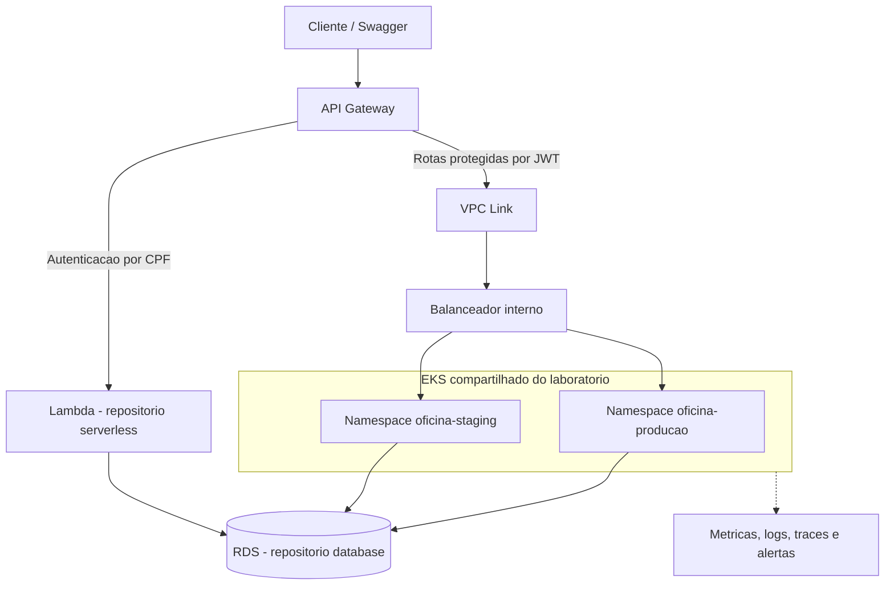

# Arquitetura planejada do laboratorio

Todos os componentes AWS abaixo estao planejados. O codigo atual so prepara
nomenclatura, CIDRs e validacao local; nao implementa essa arquitetura ainda.

## Rede

Planejar subnets em pelo menos duas zonas. API e banco devem comunicar pela rede
privada. A entrada externa da aplicacao deve passar pelo Gateway, com autenticacao
e regras adequadas a cada rota.

A estrategia de saida (NAT e/ou endpoints) precisa ser dimensionada na etapa AWS.
Nao incluir componentes cobrados continuamente antes de estimar uso e duracao.

## Ambientes

Para o laboratorio, a proposta e compartilhar um EKS e separar namespaces,
configuracoes, permissoes e rotas de staging e producao. O nome producao e o
ambiente de demonstracao da branch master, nao uma declaracao de isolamento
corporativo completo.

A falha do cluster ou de componentes compartilhados pode afetar os dois ambientes.
Namespaces sozinhos nao fornecem isolamento de rede; RBAC, NetworkPolicy e acesso
a segredos por workload ainda precisam ser implementados.

## Responsabilidades

| Repositorio | Responsabilidade |
|---|---|
| Oficina-infra-kubernetes | Rede, EKS, API Gateway, VPC Link, componentes compartilhados e infraestrutura de monitoramento |
| Oficina-Mecanica | API, imagem, migrations, Deployment/Service, probes, requests/limits e HPA da aplicacao |
| Oficina-serverless | Funcoes, IAM especifico, fila de notificacoes e DLQ |
| Oficina-infra-database | RDS, backups e regras de acesso ao banco |

Um recurso deve ter um unico dono. A plataforma recebe configuracoes/identificadores
das funcoes e da aplicacao para integrar o Gateway. Rede e cluster podem ser
provisionados antes dessas integracoes; o Gateway e concluido quando os destinos
existirem. O banco recebe os identificadores de rede publicados pela plataforma.

A instrumentacao da API/Lambdas pertence aos respectivos repositorios.
Os manifests locais de kind e PostgreSQL continuam na API para desenvolvimento.

## Provas necessarias na fase AWS

- Roteamento pelo Gateway e rejeicao de tokens invalidos.
- Lambda consultando cliente/status no banco e emitindo token valido.
- API usando RDS e autorizacao por perfil e propriedade da OS.
- HPA funcional, recursos dos pods e capacidade de nos adequada.
- Healthchecks e recuperacao de replicas.
- Logs JSON correlacionados, traces e dashboards com as metricas do desafio.
- Deploy automatico das duas branches e evidencia das pipelines.
- RFCs, ADRs e procedimentos de rollback e remocao dos recursos.

Nenhuma dessas provas de nuvem e substituida pelo check validate-terraform deste PR.
